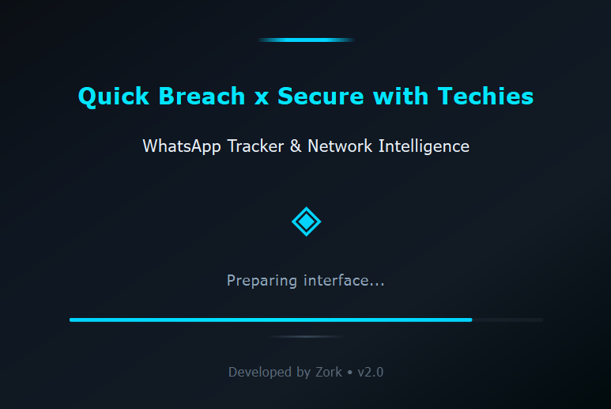
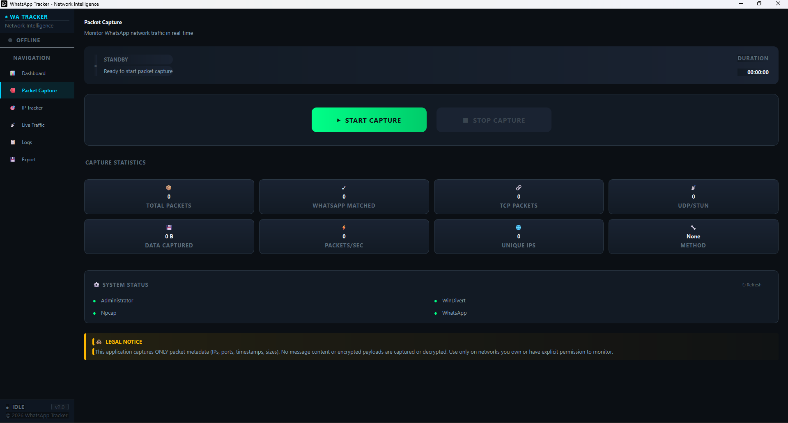

<div align="center">

<!-- Logo First -->


<br/>

<!-- Animated Header Banner - Responsive -->
<picture>
  <source media="(max-width: 480px)" srcset="https://capsule-render.vercel.app/api?type=waving&color=0:25D366,100:128C7E&height=150&section=header&text=WhatsApp%20Tracker&fontSize=28&fontColor=ffffff&animation=fadeIn&fontAlignY=40">
  <source media="(max-width: 768px)" srcset="https://capsule-render.vercel.app/api?type=waving&color=0:25D366,100:128C7E&height=180&section=header&text=WhatsApp%20Traffic%20Tracker&fontSize=32&fontColor=ffffff&animation=fadeIn&fontAlignY=38&desc=🛡️%20Cybersecurity-Grade%20Analysis&descAlignY=58&descSize=14">
  
</picture>

<br/>

<!-- Logo - Responsive -->



<!-- Typing Animation - Responsive -->
<picture>
  <source media="(max-width: 480px)" srcset="https://readme-typing-svg.demolab.com?font=Fira+Code&weight=600&size=14&pause=1000&color=25D366&center=true&vCenter=true&random=false&width=320&lines=SOC-Style+Dashboard;Packet+Analysis;Defensive+Security">
  <source media="(max-width: 768px)" srcset="https://readme-typing-svg.demolab.com?font=Fira+Code&weight=600&size=18&pause=1000&color=25D366&center=true&vCenter=true&random=false&width=450&lines=Professional+SOC+Dashboard;Real-Time+Packet+Analysis;Educational+Security;PyQt6+Dark+UI">
  
</picture>

<br/><br/>

<!-- Animated Badges -->


<br/>

<!-- Platform Compatibility Badges -->


<br/>


<br/>

---

### 🎯 A modern **PyQt6-based SOC-style dashboard** for **authorized, educational network traffic analysis**

<br/>

<!-- Download Button -->
[](https://github.com/samay825/WhatsApp-Network-Tracker/releases/tag/v2.0)

---

</div>

<br/>

## 🌟 Overview

<table>
<tr>
<td>

**WhatsAppTrafficTracker** is a **professional cybersecurity dashboard** designed for:

| Purpose | Description |
|---------|-------------|
| 📚 **Learning** | Network traffic analysis fundamentals |
| 🔄 **Understanding** | Real-time packet flows & patterns |
| 🛡️ **Practicing** | Defensive / Blue-team concepts |

</td>
<td>

```
╔══════════════════════════════════╗
║     METADATA CAPTURE ONLY        ║
╠══════════════════════════════════╣
║  ✅ IPs, Ports, Protocols        ║
║  ✅ Timestamps & Sizes           ║
║  ❌ NO Message Access            ║
║  ❌ NO Decryption                ║
║  ❌ NO MITM Attacks              ║
╚══════════════════════════════════╝
```

</td>
</tr>
</table>


## 🖥️ Interface Preview

<div align="center">

> 🎨 **Dark SOC-inspired UI** with smooth hover effects and clean alignment

<br/>

<!-- Responsive Image Container -->


</div>

<br/>

---

## 🔥 Key Features

<div align="center">

| Feature | Description |
|:-------:|:------------|
| 🎨 | **Cybersecurity Dark Theme** — Modern SOC-inspired UI design |
| 📡 | **Smart Packet Capture** — Filter-based intelligent capturing |
| 🧭 | **IP Tracker** — Location mapping & traffic correlation |
| 📊 | **Live Monitoring** — Real-time traffic visualization |
| 🧾 | **Detailed Logs** — Severity levels & timestamps |
| 📤 | **Export Options** — CSV & JSON support |
| 🧵 | **Performance** — Thread-safe, non-blocking GUI |
| 📱 | **Responsive Design** — Works on all screen sizes |
| 🌐 | **Cross-Platform** — Windows, macOS, Linux support |

</div>

<!-- Mobile-Friendly Feature Cards -->
<details>
<summary><b>📱 Mobile View - Tap to see features</b></summary>

<br/>

<div align="center">

| 🎨 Dark Theme | 📡 Packet Capture | 🧭 IP Tracker |
|:-------------:|:-----------------:|:-------------:|
| Modern UI | Smart Filtering | Location Map |

| 📊 Live Monitor | 🧾 Logs | 📤 Export |
|:---------------:|:------:|:----------:|
| Real-time | Severity | CSV/JSON |

</div>

</details>

<br/>

---

## 🚀 Quick Start

<!-- Desktop Flowchart -->
<div align="center">


</div>

<!-- Mobile-Friendly Alternative -->
<details>
<summary><b>📱 Mobile View - Quick Start Steps</b></summary>

<br/>

```
📦 Step 1: Download ZIP
      ⬇️
📂 Step 2: Extract Files  
      ⬇️
▶️ Step 3: Run .exe
      ⬇️
🎯 Step 4: Start Capture
      ⬇️
📞 Step 5: Make Call
      ⬇️
📊 Step 6: View Data
```

</details>

### 📋 Step-by-Step Guide

<details>
<summary><b>📥 Click to expand installation steps</b></summary>

<br/>

| Step | Action | Details |
|:----:|--------|---------|
| **1** | 📦 Download | Get the latest release ZIP |
| **2** | 📂 Extract | Unzip to any location |
| **3** | ▶️ Run | Launch `whatsapptracker.exe` |
| **4** | ⚠️ Windows Warning | Click **More info → Run anyway** |
| **5** | 🎯 Start | Click **Start Capture** button |
| **6** | 💬 WhatsApp | Install from Microsoft Store & open |
| **7** | 📞 Call | Start a **voice call** (with consent) |
| **8** | 📊 View | Check **IP Tracker** tab for metadata |

</details>

<br/>

> [!NOTE]
> If the remote user has **"Protect IP address"** enabled, IP details **will not appear** — this is expected behavior.

<br/>

---

## 🔐 Security & Privacy First

<div align="center">

| ✅ What We DO | ❌ What We DON'T |
|:-------------:|:----------------:|
| Capture metadata only | Access messages |
| Log IPs & ports | Inspect payloads |
| Track protocols | Bypass encryption |
| Record timestamps | Intercept credentials |
| Respect privacy | Run hidden processes |

</div>

<br/>

> [!IMPORTANT]
> **Use only on systems or networks you own or have explicit permission to analyze.**

<br/>

---


<!-- Mobile-Friendly Tech Cards -->
<details>
<summary><b>📱 Mobile View - Tech Stack</b></summary>

<br/>

<div align="center">

| Technology | Description |
|:----------:|:------------|
| 🐍 **Python 3.11+** | Modern async/await support |
| 🖼️ **PyQt6** | Beautiful dark UI framework |
| 📡 **Packet Interception** | Windows native APIs |
| 🏗️ **Modular Architecture** | Production-ready codebase |
| 🌐 **Cross-Platform** | Windows, macOS, Linux |
| 📱 **Responsive** | Mobile-friendly docs |

</div>

</details>

<br/>

---

## ⚠️ Legal Disclaimer

<div align="center">

> [!CAUTION]
> This project is intended **strictly for educational, debugging, and defensive security purposes**.  
> Unauthorized interception of network traffic may violate local laws.
>
> **The author takes no responsibility for misuse.**  
> This project is **not affiliated with WhatsApp or Meta**.

</div>

<br/>

---

## 🤝 Contributing

<div align="center">

We welcome contributions! Here's how you can help:

| Type | Description |
|:----:|-------------|
| 🎨 | UI/UX improvements |
| ⚡ | Performance optimizations |
| 🔧 | Additional analysis modules |
| 📝 | Documentation updates |
| 🐛 | Bug fixes |

</div>

<br/>

> [!TIP]
> Please keep all contributions **legal and privacy-respecting**.

<br/>

---

<div align="center">

## 💖 Support the Project

<br/>

If you find this project useful, show your support!

<br/>

[](https://github.com/samay825/WhatsApp-Network-Tracker)
[](https://github.com/samay825/WhatsApp-Network-Tracker/fork)
[](https://twitter.com/intent/tweet?text=Check%20out%20WhatsApp%20Traffic%20Tracker!)

<br/>

---

<br/>

### Made with 💚 for the Cybersecurity Community

<br/>

<!-- Platform Icons Row -->
<p>


</p>

<sub>📱 Zork Naam hai Amara</sub>

<br/>

<!-- Footer Wave - Responsive -->
<picture>
  <source media="(max-width: 480px)" srcset="https://capsule-render.vercel.app/api?type=waving&color=0:25D366,100:128C7E&height=80&section=footer">
  <source media="(max-width: 768px)" srcset="https://capsule-render.vercel.app/api?type=waving&color=0:25D366,100:128C7E&height=100&section=footer">
  
</picture>

</div>
